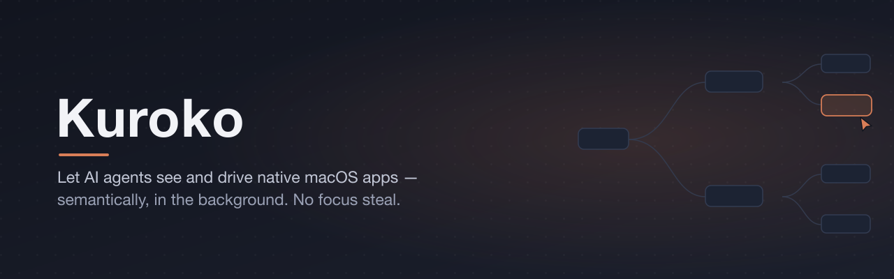
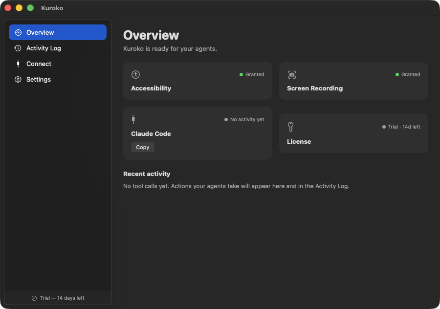

<div align="center">



[Download](https://github.com/olegklimakov/kuroko/releases/latest) ·
[Buy a license](https://klimakov.me/projects/kuroko/buy) ·
[Product page](https://klimakov.me/projects/kuroko)

<br>



</div>

---

Kuroko is an **MCP server** you hand to an AI coding agent (Claude Code and any
MCP-compatible host) so it can *see* and *drive* your native macOS app through
the **Accessibility (AX) API** — semantic, not pixel-based, and fully in the
background: no focus steal, no cursor hijack.

### Why not computer-use?

`computer-use` drives the screen by moving the real cursor and clicking pixels —
it takes over your machine. Kuroko instead:

- reads the app's real **Accessibility tree** (roles, labels, ids, frames),
- acts via semantic **AX actions** (`AXPress`, set selection/value), falling back
  to input posted **directly to the app process** (`CGEvent.postToPid`),
- captures **window screenshots** with ScreenCaptureKit even when the window is
  occluded.

All of it runs while you keep working in another app.

## Install

1. **Download** the latest `Kuroko.dmg` from
   [Releases](https://github.com/olegklimakov/kuroko/releases/latest).
2. Open the DMG and **drag Kuroko into Applications**.
3. Launch **Kuroko**. It runs a **14-day free trial** — no account, no card.

Kuroko is a signed & notarized **direct download** (the App Store sandbox forbids
driving other apps, so it isn't distributed there). Requires **macOS 14 or later**.
It keeps itself up to date: with your go-ahead it checks for new versions and
installs verified updates in place.

## Grant permissions — to the right process

macOS grants Accessibility and Screen Recording **per process**. Grant them to
**whatever runs the Kuroko MCP server** — your terminal or agent host (Terminal,
iTerm, VS Code, Claude Desktop, …) — **not** to `Kuroko.app` itself.

- **Accessibility** (required) — read the UI tree and act.
- **Screen Recording** (only for the `screenshot` tool).

System Settings → Privacy & Security → {Accessibility, Screen Recording} → enable
your terminal / host. Have the agent call `check_permissions` to confirm the
*server* process sees the grant.

## Connect it to your agent

The app's **Connect** tab lists every agent host on your Mac — Claude Code, Claude
Desktop, Codex & ChatGPT Desktop, Cursor, Windsurf, VS Code — each with its live
status and one button that adds or removes Kuroko's MCP entry. Hosts that read
skills (Claude Code, Codex) get the `kuroko` skill installed with it, so the agent
knows the see → find → act → verify workflow from the start.

To wire it up by hand, the bundled server binary lives at
`/Applications/Kuroko.app/Contents/Helpers/kuroko`.

**Claude Code — plugin (recommended).** One install gets you both the MCP
server config and a `kuroko` skill that teaches the agent the
see → find → act → verify workflow:

```
/plugin marketplace add olegklimakov/kuroko
/plugin install kuroko@kuroko
```

**Claude Code — MCP server only:**

```bash
claude mcp add kuroko -- "/Applications/Kuroko.app/Contents/Helpers/kuroko" mcp
```

**Claude Desktop** (`~/Library/Application Support/Claude/claude_desktop_config.json`):

```json
{
  "mcpServers": {
    "kuroko": {
      "command": "/Applications/Kuroko.app/Contents/Helpers/kuroko",
      "args": ["mcp"]
    }
  }
}
```

Any MCP-capable host works. The **Connect** tab's manual section shows the same
JSON with your resolved binary path.

## What the agent gets

Read/inspect: `list_apps`, `get_ui_tree`, `read_element`, `assert_visible`,
`check_permissions`. Act (background, no focus steal): `tap`, `double_tap`,
`input_text`, `press_key`, `scroll`, `screenshot`, `launch_app`, `stop_app`.

The server also exposes a `guide://usage` MCP resource (the drive-and-verify
workflow) and `policy://current` (the live effective policy).

## Security & trust model

- **Non-sandboxed by design** — it must drive other apps. It is signed with a
  Developer ID and notarized by Apple.
- **App policy**: sensitive apps (Terminal, Keychain Access, 1Password, System
  Settings) are blocked by default; write tools can be disarmed entirely; you can
  switch to an allowlist. See [docs/policy.md](docs/policy.md).
- **Secure fields**: typing into password fields (`AXSecureTextField`) is refused.
- **Action log**: every tool call is recorded locally
  (`~/Library/Application Support/kuroko/actions.jsonl`) and shown in the app.
- **Licensing**: a 14-day trial is built in; a license activates online on up to
  3 Macs, and you can deactivate a device to move a seat.

⚠️ **Prompt-injection caveat**: an agent driving your apps acts on whatever
instructions it receives, including text it reads on screen. Keep the policy
tight (allowlist your app under test) and review the action log.

## License

Kuroko is a paid product. A **14-day trial** is built in; after that a license is
required — buy one at **[klimakov.me/projects/kuroko/buy](https://klimakov.me/projects/kuroko/buy)**
(one-time, perpetual for the current major version, up to 3 Macs). Activate it in
**Settings → License**.

Use of the software is governed by the [End-User License Agreement](EULA.md).

## Docs

- [Install & connect](docs/install.md)
- [Troubleshooting](docs/troubleshooting.md)
- [Policy reference](docs/policy.md)
- [Changelog](CHANGELOG.md)
